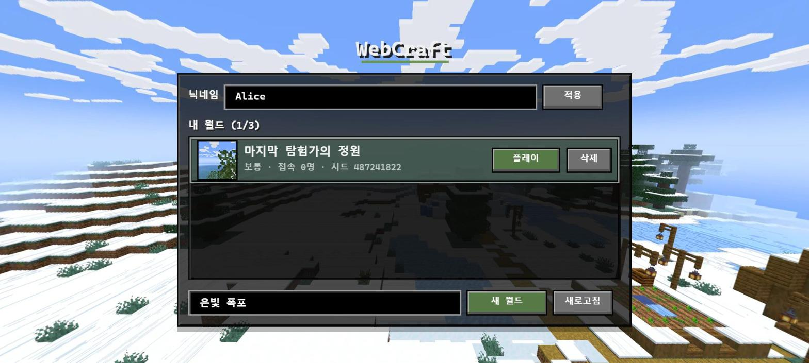
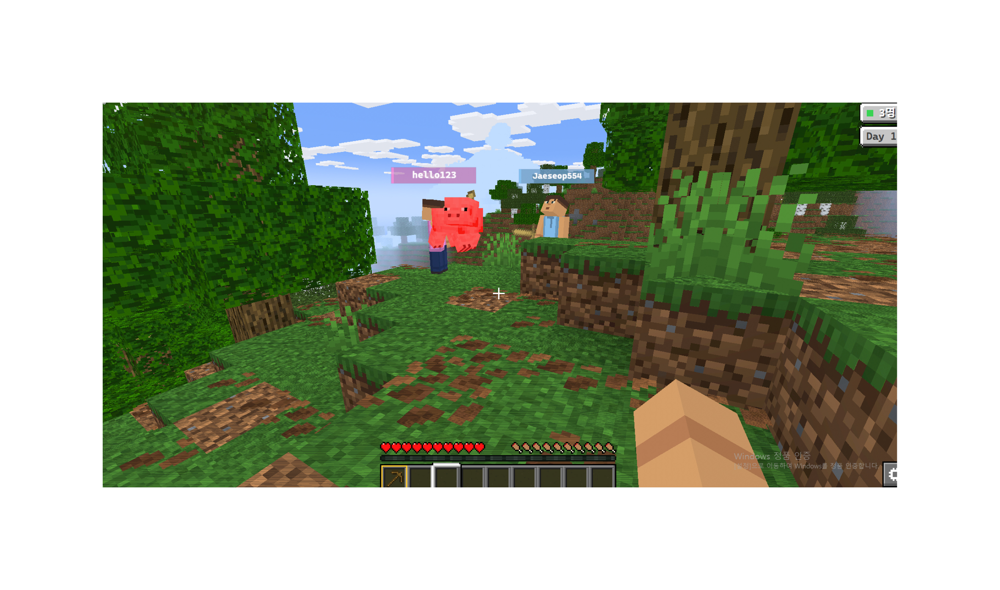

# WebCraft Spring Backend


 **내일배움캠프 단기심화 9기 숙련주차**의 Spring Boot 백엔드 구현체입니다. 게임 클라이언트/엔진(`webcraft-engine`)은 의존성으로 제공되고(fork of the tutor's repo), 이 저장소는 플레이어 등록, 월드 생성/조회, 채팅, WebSocket 실시간 통신, 접속 상태 관리, 멀티 서버 채팅 릴레이 등 **백엔드 전체를 Lv1~Lv20 과제 단위로 구현**한 결과물입니다.

## 실행 화면

| 닉네임 등록 & 월드 목록 (Lv3, Lv4) | 실제 플레이 화면 |
|---|---|
|  |  |

## 목차

- [실행 화면](#실행-화면)
- [기술 스택](#기술-스택)
- [아키텍처](#아키텍처)
- [빌드 & 실행](#빌드--실행)
- [구현 상세: Lv1 ~ Lv20](#구현-상세-lv1--lv20)
- [트러블슈팅 / 설계 고민](#트러블슈팅--설계-고민)

## 기술 스택

| 분류 | 기술 | 용도 |
|---|---|---|
| Language / Runtime | Java 21 | 애플리케이션 구현 언어 |
| Framework | Spring Boot 4.1 (Web MVC, WebSocket, Validation) | REST API, WebSocket 서버, 요청 검증 |
| Persistence | Spring Data JPA + Hibernate, MySQL 8.0 | 플레이어/월드/채팅/트라이얼 상태 영속화 |
| Cache / Realtime infra | Redis 7.4 (Spring Data Redis) | 접속 상태(presence), 최근 채팅 캐시, 레이트 리미터, 멀티 서버 Pub/Sub |
| Game engine | `io.github.f-api:webcraft-engine` | 게임 클라이언트 및 월드 시뮬레이션 엔진(제공 의존성) |
| Build / Infra | Gradle, Docker / Docker Compose | 빌드, 멀티 서버(app-a/app-b) 컨테이너 실행 |
| Test | JUnit 5, AssertJ, Mockito, H2, Testcontainers | 단위/통합 테스트 |

## 아키텍처

- **3계층 구조**: Controller → Service → Repository로 역할을 분리하고, 엔티티 연관관계는 단방향으로만 설정했습니다.
- **패키지 구조**: 도메인별 최상위 패키지(`chat`, `player`, `world`, `trial`, `presence`, `ws`) 아래 `controller`/`service`/`repository`/`entity`/`dto`로 세분화했습니다. 도메인을 넘나드는 공통 로직은 `common`, 설정은 `config`에 뒀습니다.
- **요청 흐름**
  - REST: `Controller → Service → Repository` (예: `POST /players`, `GET /worlds/{id}/chats`)
  - WebSocket: `NicknameHandshakeInterceptor`(연결 시 인증) → `GameWebSocketHandler` → `MessageRouter`(type별 라우팅) → 각 `EngineMessageHandler` 구현체(`MoveWsHandler`, `ChatWsHandler`, `PingWsHandler`, `OnlineUsersWsHandler`)
  - 멀티 서버 채팅: `ChatWsHandler → ChatService(저장) → ChatDelivery → (LocalChatSender | ChatRelay+Redis Pub/Sub) → 각 서버의 LocalChatSender → WorldSessionRegistry의 세션들`

## 빌드 & 실행

### Docker Compose로 실행 (권장)

```bash
docker compose up -d --build
```

- MySQL 8.0, Redis 7.4, 그리고 애플리케이션 두 인스턴스(`app-a`: `http://localhost:8080`, `app-b`: `http://localhost:8081`)가 함께 뜹니다(Lv20 멀티 서버 구성).
- 비밀번호 등 민감한 값은 저장소에 커밋하지 않고 `.env` 파일(gitignore 처리됨)로 주입합니다. 최초 실행 전 저장소 루트에 아래와 같이 `.env`를 만들어 주세요.

  ```env
  MYSQL_ROOT_PASSWORD=<원하는 강한 비밀번호>
  MYSQL_DATABASE=game_expert
  MYSQL_USER=game_expert
  MYSQL_PASSWORD=<원하는 강한 비밀번호>
  ```
- 모든 포트는 `127.0.0.1`에만 바인딩되어 있어 외부 네트워크에는 노출되지 않습니다.

### 로컬에서 직접 실행

```bash
./gradlew bootRun   # Windows: gradlew.bat bootRun
./gradlew test      # Windows: gradlew.bat test
```

- 실행 전 Docker로 MySQL/Redis 컨테이너가 떠 있어야 하며, `application.properties`의 `spring.datasource.*`, `spring.data.redis.*` 설정(및 `.env`와 일치하는 환경변수)을 확인해야 합니다.
- 첫 빌드 시 `verifyEngine` 태스크가 `webcraft-engine` 아티팩트 체크섬을 검증하므로 네트워크 접근이 필요할 수 있습니다.

## 구현 상세: Lv1 ~ Lv20

### Lv 1. Docker로 MySQL과 Redis 설정

- **무엇을 구현했는가**: `docker-compose.yml`로 MySQL 8.0과 Redis 7.4 컨테이너를 구성하고, 애플리케이션이 환경변수를 통해 접속 정보를 주입받도록 설정했습니다.
- **어떻게 구현했는가**: `mysqladmin ping`, `redis-cli ping` 기반의 `healthcheck`를 붙여 두 컨테이너가 완전히 기동될 때까지 대기할 수 있게 했고, `MYSQL_*`/`REDIS_*` 환경변수에 로컬 개발용 기본값을 지정해 별도 `.env` 없이도 바로 띄울 수 있도록 했습니다. `application.properties`는 `${MYSQL_HOST:localhost}`처럼 환경변수 우선 + 로컬 기본값 패턴으로 작성해, 로컬 실행과 컨테이너 실행(Lv20) 양쪽에서 같은 설정 파일을 재사용합니다.
- **관련 파일**: [`docker-compose.yml`](docker-compose.yml), [`src/main/resources/application.properties`](src/main/resources/application.properties)

### Lv 2. SQL을 JPA 인덱스로 표현하기

- **무엇을 구현했는가**: 채팅 조회 시 자주 사용하는 "특정 월드의 채팅을 최신순으로" 쿼리 패턴에 맞는 인덱스를 엔티티에 명시했습니다.
- **어떻게 구현했는가**: `ChatMessage`에 `@Table(indexes = @Index(columnList = "world_id, created_at"))`로 `(world_id, created_at)` 복합 인덱스를 선언했습니다. `world_id` 등호 조건과 `created_at` 정렬을 같은 인덱스로 커버해, Lv5/Lv17의 최신 채팅·커서 조회가 풀 스캔 없이 처리되도록 했습니다.
- **관련 파일**: [`src/main/java/com/gameexpert/chat/entity/ChatMessage.java`](src/main/java/com/gameexpert/chat/entity/ChatMessage.java)

### Lv 3. 요청 검증과 DTO: 플레이어 등록

- **무엇을 구현했는가**: 플레이어 등록 API(`POST /players`)의 입력값 검증과 닉네임 중복 처리를 구현했습니다.
- **어떻게 구현했는가**: `CreatePlayerRequest`에 `@NotBlank`, `@Size(min=2, max=12)`, `@Pattern("^[a-zA-Z0-9_]+$")`를 선언하고 컨트롤러에서 `@Valid`로 위임해, 형식 검증은 컨트롤러 계층에서 한 번에 끝나도록 했습니다. 서비스 계층에서는 `existsByNickname`으로 사전 검사를 하지만, 동시에 같은 닉네임으로 요청이 들어오는 레이스 컨디션까지 막기 위해 `saveAndFlush` 후 `DataIntegrityViolationException`(DB unique 제약 위반)을 잡아 동일하게 `ConflictException("DUPLICATE_NICKNAME")`으로 변환했습니다. 즉 애플리케이션 레벨 검사 + DB 제약조건 이중 방어 구조입니다.
- **관련 파일**: [`player/controller/PlayerController.java`](src/main/java/com/gameexpert/player/controller/PlayerController.java), [`player/dto/CreatePlayerRequest.java`](src/main/java/com/gameexpert/player/dto/CreatePlayerRequest.java), [`player/service/PlayerService.java`](src/main/java/com/gameexpert/player/service/PlayerService.java)

### Lv 4. 월드 생성

- **무엇을 구현했는가**: 월드 생성 API의 생성 정책(최대 개수 제한, seed 결정, 소유자 검증)을 구현했습니다.
- **어떻게 구현했는가**: `WorldService.createWorld`는 `worldOperations.duringCreation(...)`으로 생성 로직 전체를 락 범위 안에 넣어, 동시에 여러 요청이 들어와도 `MAX_WORLDS(=3)` 제한이 정확히 지켜지도록 했습니다. 락 안에서는 요청에 담긴 소유자 닉네임이 실제 존재하는 플레이어인지 확인하고, 이름/디버그 시드 유효성을 검증한 뒤 월드를 저장합니다. 생성 결과는 `CommittedWorldCreation` record로 감싸는데, record의 커스텀 생성자에서 `worldId > 0`, 이름 길이, seed 범위, `difficulty != null` 같은 불변식을 검증하도록 해 "저장은 됐지만 잘못된 값"이 상위 계층으로 새어나가지 못하게 했습니다.
- **관련 파일**: [`world/service/WorldService.java`](src/main/java/com/gameexpert/world/service/WorldService.java)

### Lv 5. 채팅 저장과 내역 조회

- **무엇을 구현했는가**: 채팅 메시지 저장, 그리고 최근 N개 메시지를 오래된 순으로 조회하는 기능을 구현했습니다.
- **어떻게 구현했는가**: `saveMessage`는 월드 존재를 확인한 뒤 `ChatMessage`를 저장하고, `ApplicationEventPublisher`로 `ChatSavedEvent`를 발행합니다. 저장 로직과 "저장 이후 벌어지는 일(캐시 무효화, 전송 등)"을 이벤트로 분리해 두어 서비스 간 직접 의존을 줄였습니다. `getRecentMessages`는 `limit`을 1~100 사이로 clamp한 뒤 `findByWorldIdOrderByCreatedAtDescIdDesc`로 최신순으로 가져오고, 클라이언트가 기대하는 시간순으로 보이도록 리스트를 `reverse`해서 응답합니다.
- **관련 파일**: [`chat/service/ChatService.java`](src/main/java/com/gameexpert/chat/service/ChatService.java)

### Lv 6. 최근 채팅 조회 API 구현

- **무엇을 구현했는가**: `GET /worlds/{worldId}/chats` REST API를 구현했습니다.
- **어떻게 구현했는가**: 컨트롤러는 `@PathVariable worldId`와 `@RequestParam(defaultValue="50") limit`을 받아 서비스에 그대로 위임하고 결과를 감싸 반환하는 것 외의 로직을 갖지 않습니다. 실제 조회 로직(및 Lv18에서 추가되는 캐시 조회)은 `RecentChatQueryService`에 있어, "컨트롤러는 라우팅과 응답 변환만"이라는 3계층 원칙을 지켰습니다.
- **관련 파일**: [`chat/controller/WorldChatController.java`](src/main/java/com/gameexpert/chat/controller/WorldChatController.java)

### Lv 7. WebSocket 연결과 사용자 식별

- **무엇을 구현했는가**: WebSocket 핸드셰이크 시점에 쿼리 파라미터 닉네임과 경로의 월드 ID로 접속자를 식별하는 로직을 구현했습니다.
- **어떻게 구현했는가**: `NicknameHandshakeInterceptor.beforeHandshake`에서 요청의 `nickname` 파라미터로 `Player`를 조회하고, URL 경로(`/ws/worlds/{worldId}`)에서 정규식으로 추출한 `worldId`로 `World`를 조회합니다. 둘 중 하나라도 실패하면 핸드셰이크 자체는 통과시키되 `attributes`에 에러 코드(닉네임 문제 4000, 월드 문제 4001)만 심어 두고, 실제 연결 종료는 이후 `WebSocketHandler` 쪽에서 이 코드를 보고 처리하도록 책임을 나눴습니다. 성공한 경우에는 nickname, worldId, playerId, 월드 seed/난이도를 세션 속성에 저장해, 이후 모든 메시지 핸들러가 DB를 다시 조회하지 않고 세션 속성만으로 컨텍스트를 얻을 수 있게 했습니다.
- **관련 파일**: [`ws/NicknameHandshakeInterceptor.java`](src/main/java/com/gameexpert/ws/NicknameHandshakeInterceptor.java)

### Lv 8. HandshakeInterceptor 등록

- **무엇을 구현했는가**: Lv7의 인터셉터와 게임 WebSocket 핸들러를 실제 엔드포인트에 등록했습니다.
- **어떻게 구현했는가**: `WebSocketConfig`가 `/ws/worlds/{worldId}` 경로에 `GameWebSocketHandler`를 등록하면서 `addInterceptors(nicknameInterceptor)`로 Lv7의 검증을 연결 파이프라인에 끼워 넣었습니다. 허용 Origin은 하드코딩하지 않고 `EngineProperties`에서 읽어와, 로컬/배포 환경별로 CORS 정책을 다르게 가져갈 수 있게 했습니다.
- **관련 파일**: [`config/WebSocketConfig.java`](src/main/java/com/gameexpert/config/WebSocketConfig.java)

### Lv 9. 월드별 WebSocket 세션 관리

- **무엇을 구현했는가**: 월드 단위로 현재 접속 중인 세션들을 스레드 안전하게 관리하는 레지스트리를 구현했습니다.
- **어떻게 구현했는가**: `WorldSessionRegistry`는 `Map<Long, ConcurrentHashMap<String, Entry>>` 형태로 "월드 → (닉네임 → 세션 Entry)"를 관리합니다. 닉네임 키는 대소문자를 구분하지 않도록 `toLowerCase`로 정규화하고, `register`는 `putIfAbsent`로 동일 닉네임의 중복 접속을 막습니다. `register`/`remove` 모두 `compute`/`computeIfPresent`를 사용해 "조회 후 수정" 사이에 다른 스레드가 끼어들 수 없도록 원자적으로 처리했고, `remove`는 세션 객체까지 비교(`current.session() == session`)해서 오래된 연결이 새 연결을 잘못 지우는 상황을 막았습니다.
- **관련 파일**: [`ws/WorldSessionRegistry.java`](src/main/java/com/gameexpert/ws/WorldSessionRegistry.java)

### Lv 10. Redis 접속 상태 관리

- **무엇을 구현했는가**: 여러 서버 인스턴스에서도 공유되는 "월드별 접속자 수/생존 여부"를 Redis로 관리했습니다.
- **어떻게 구현했는가**: `world:{worldId}:presence`라는 Sorted Set에 연결 ID를 멤버로, 만료 시각(현재 시각 + 90초)을 score로 저장합니다. 하트비트(`ping` 메시지, Lv11)가 올 때마다 `ZADD ... XX`(`ZAddArgs.ifExists()`)로 **기존에 존재하는 멤버만 score를 갱신**하도록 했는데, 이는 이미 끊긴 연결이 재추가되어 유령 접속자로 남는 것을 방지하기 위한 설계입니다. `onlineCount` 조회 시에는 먼저 `removeRangeByScore`로 만료된 멤버를 정리한 뒤 `zCard`로 개수를 세어, TTL이 지난 접속자가 카운트에 남지 않도록 했습니다. Set 전체에는 별도로 180초 키 TTL을 둬서, 트래픽이 끊겨 정리가 전혀 호출되지 않아도 결국 Redis 메모리에서 자동 회수됩니다.
- **관련 파일**: [`presence/PresenceService.java`](src/main/java/com/gameexpert/presence/PresenceService.java)

### Lv 11. 메시지 라우팅과 Ping/Pong

- **무엇을 구현했는가**: 클라이언트가 보내는 WebSocket 메시지를 `type` 필드 기준으로 알맞은 핸들러에 위임하는 라우터와, 연결 유지를 위한 Ping/Pong 핸들러를 구현했습니다.
- **어떻게 구현했는가**: `MessageRouter`는 생성 시점에 모든 `EngineMessageHandler` 빈을 `supportedTypes()` 기준으로 `Map<String, EngineMessageHandler>`로 색인해 둡니다. 메시지가 오면 JSON 파싱 → `type` 필드 추출 → 해당 핸들러 조회 → 실행 순으로 처리하며, 각 실패 유형(JSON 파싱 실패, 미지원 타입, 액션 큐 초과, 잘못된 파라미터, 그 외 예외)마다 다른 에러 코드로 응답해 클라이언트가 원인을 구분할 수 있게 했습니다. `PingWsHandler`는 레지스트리에 등록된 연결이 지금 이 세션과 정확히 같은지 확인한 뒤 `PresenceService.heartbeat`를 호출하고 `pong`을 응답합니다. 즉 Ping은 단순 응답이 아니라 Lv10의 presence TTL을 갱신하는 트리거 역할까지 겸합니다.
- **관련 파일**: [`ws/MessageRouter.java`](src/main/java/com/gameexpert/ws/MessageRouter.java), [`ws/handler/PingWsHandler.java`](src/main/java/com/gameexpert/ws/handler/PingWsHandler.java)

### Lv 12. 플레이어 이동 요청 처리

- **무엇을 구현했는가**: 클라이언트의 `move` 메시지를 게임 엔진이 처리할 수 있는 액션으로 변환해 큐에 넣는 처리를 구현했습니다.
- **어떻게 구현했는가**: `MoveWsHandler`는 `WsFields` 유틸리티로 `x`/`y`/`z`/`yaw`/`pitch`/`crouching`/`gliding` 값을 검증하며 추출합니다(`finiteNumber`, `finiteFloat` 등으로 `NaN`/`Infinity` 같은 비정상 값을 걸러냄). 검증된 값은 `WorldEngineManager.enqueue`로 해당 월드의 엔진 액션 큐에 `PlayerAction.Move`로 적재되며, 실제 위치 갱신/충돌 처리는 엔진(제공 코드) 쪽에서 틱마다 소비합니다. 핸들러는 "요청을 검증해서 엔진 큐에 넣는" 책임만 가지고, 게임 로직 자체는 갖지 않습니다.
- **관련 파일**: [`ws/handler/MoveWsHandler.java`](src/main/java/com/gameexpert/ws/handler/MoveWsHandler.java)

### Lv 13. 채팅 요청 처리와 응답 구성

- **무엇을 구현했는가**: 클라이언트의 `chat` 메시지를 검증 → 요율 제한 → 명령어 해석 → 저장 → 응답 구성까지 이어지는 파이프라인으로 처리했습니다.
- **어떻게 구현했는가**: `ChatWsHandler.handle`은 먼저 내용 길이를 1~200자로 검증하고, 세션 속성에 저장된 `playerId`(Lv7)로 `ChatRateLimitService`(Lv19)를 확인해 초과 시 `CHAT_COOLDOWN` 에러만 보내고 종료합니다. 통과하면 `ChatCommands`로 특수 명령어를 해석하고, `ChatService.saveMessage`로 DB에 저장한 뒤 그 결과(sender, content, 저장 시각)로 `ChatResponse`(`type="chat"`)를 구성합니다. 저장된 데이터를 그대로 응답에 실어, 클라이언트가 보내는 값이 아니라 서버가 확정한 값(트림/치환된 내용, DB 타임스탬프)이 전파되도록 했습니다.
- **관련 파일**: [`ws/dto/ChatResponse.java`](src/main/java/com/gameexpert/ws/dto/ChatResponse.java), [`ws/handler/ChatWsHandler.java`](src/main/java/com/gameexpert/ws/handler/ChatWsHandler.java)

### Lv 14. 같은 월드의 참여자에게 채팅 전송

- **무엇을 구현했는가**: 저장된 채팅을 같은 월드에 접속한 모든 클라이언트에게 브로드캐스트하는 기능을 구현했습니다.
- **어떻게 구현했는가**: `LocalChatSender.send`는 `WorldBroadcaster.broadcast(worldId, message)`를 호출해 Lv9의 `WorldSessionRegistry`에 등록된 해당 월드의 모든 세션에 메시지를 전송합니다. 이 클래스는 "지금 이 서버 인스턴스에 붙어 있는 세션들에게만" 보내는 로컬 전송 책임만 갖도록 좁게 설계했고, 실제로 채팅을 내보내는 지점인 `ChatDelivery`가 pub/sub 활성화 여부에 따라 `LocalChatSender`(단일 서버) 또는 `ChatRelay`(Lv20, 멀티 서버)를 선택하도록 분리해, 서버가 한 대든 여러 대든 `ChatWsHandler` 쪽 코드는 변경 없이 동작합니다.
- **관련 파일**: [`chat/service/LocalChatSender.java`](src/main/java/com/gameexpert/chat/service/LocalChatSender.java), [`chat/service/ChatDelivery.java`](src/main/java/com/gameexpert/chat/service/ChatDelivery.java)

### Lv 15. 접속자 목록 조회

- **무엇을 구현했는가**: `onlineUsers` 요청에 대해 현재 같은 월드에 접속 중인 닉네임 목록을 응답하는 기능을 구현했습니다.
- **어떻게 구현했는가**: `OnlineUsersWsHandler`는 `WorldSessionRegistry.entries(worldId)`로 해당 월드의 모든 Entry를 가져와, `isOpen()`으로 살아있는 세션만 남기고 세션 속성에서 닉네임을 추출해 정렬한 뒤 `OnlineUsersResponse(users, count)`로 요청을 보낸 세션에만 응답합니다. 브로드캐스트가 아니라 요청자 1명에게만 회신한다는 점이 Lv14의 채팅 전송과 다른 지점입니다.
- **관련 파일**: [`ws/dto/OnlineUsersResponse.java`](src/main/java/com/gameexpert/ws/dto/OnlineUsersResponse.java), [`ws/handler/OnlineUsersWsHandler.java`](src/main/java/com/gameexpert/ws/handler/OnlineUsersWsHandler.java)

### Lv 16. 낙관적 락

- **무엇을 구현했는가**: 여러 요청/스레드가 동시에 같은 트라이얼 스포너 상태를 갱신할 때 발생할 수 있는 덮어쓰기를 막기 위해 낙관적 락을 적용했습니다.
- **어떻게 구현했는가**: `WorldTrialSite` 엔티티에 `@Version private long revision` 필드를 추가했습니다. 트라이얼 상태(발동 여부, 감지 인원, 보상 대기 등)는 게임 진행에 따라 자주 갱신되는데, 같은 row를 두 트랜잭션이 동시에 읽고 저장하면 먼저 커밋한 변경이 사라질 수 있습니다. `@Version`을 두면 두 번째 커밋 시 Hibernate가 버전 불일치를 감지해 `OptimisticLockException`을 던지므로, 유실 없이 재시도하거나 실패를 인지할 수 있게 됩니다.
- **관련 파일**: [`trial/entity/WorldTrialSite.java`](src/main/java/com/gameexpert/trial/entity/WorldTrialSite.java)

### Lv 17. 커서 페이지 조회

- **무엇을 구현했는가**: 채팅 내역을 offset이 아닌 커서(마지막으로 본 메시지의 생성 시각 + ID) 기준으로 페이지네이션하는 기능을 구현했습니다.
- **어떻게 구현했는가**: `ChatHistoryService.getHistory`는 `beforeCreatedAt`/`beforeId` 쌍을 커서로 받아(둘 다 없거나 둘 다 있어야 함을 검증) 그 지점보다 이전 메시지를 `limit + 1`개 조회합니다. `limit`개를 넘겨받았다면 `hasNext = true`로 판단하고, 응답에는 `limit`개까지만 담되 마지막 항목의 생성 시각/ID를 다음 커서로 내려줍니다. `created_at`이 같은 값이 여러 행에 걸릴 수 있어 `id`를 보조 커서로 함께 써서 정렬의 안정성을 보장했습니다. offset 방식과 달리 페이지가 뒤로 갈수록 조회 비용이 늘지 않는다는 점이 이 방식을 택한 이유입니다(Lv2의 `(world_id, created_at)` 인덱스가 이 조회를 지원합니다).
- **관련 파일**: [`chat/service/ChatHistoryService.java`](src/main/java/com/gameexpert/chat/service/ChatHistoryService.java)

### Lv 18. Redis 최근 채팅 캐시

- **무엇을 구현했는가**: Lv6의 최근 채팅 조회 API에 Redis 캐시를 추가해 DB 조회 빈도를 줄였습니다.
- **어떻게 구현했는가**: `RecentChatCache`는 `world:{worldId}:chat:recent:{limit}` 키에 최근 메시지 목록을 JSON으로 5초 TTL만큼 캐싱합니다. `RecentChatQueryService`가 캐시를 먼저 조회하고, 히트하면 DB를 건너뛰고, 미스면 `ChatService`로 조회한 뒤 그 결과를 캐시에 채워 넣습니다. 캐시는 정합성이 완벽히 보장되어야 하는 저장소가 아니므로, Redis 조회/저장 중 예외가 나면 `RuntimeException`을 잡아 `null`을 반환하거나 조용히 무시하도록 해 **Redis 장애가 채팅 조회 기능 자체를 막지 못하도록** 방어적으로 구성했습니다. TTL을 짧게(5초) 잡아 별도 무효화 없이도 새 메시지가 곧 반영되게 했습니다.
- **관련 파일**: [`chat/service/RecentChatCache.java`](src/main/java/com/gameexpert/chat/service/RecentChatCache.java), [`chat/service/RecentChatQueryService.java`](src/main/java/com/gameexpert/chat/service/RecentChatQueryService.java)

### Lv 19. Redis Lua로 채팅 전송 횟수 제한

- **무엇을 구현했는가**: 플레이어별로 일정 시간 동안 보낼 수 있는 채팅 횟수를 제한하는 레이트 리미터를 구현했습니다.
- **어떻게 구현했는가**: `chat:limit:{playerId}` 키에 대해 "증가시키고, 처음 증가한 경우에만 만료시간을 걸고, 제한을 넘었으면 거부"하는 로직을 Lua 스크립트(`ChatRateLimitService.ALLOW_SCRIPT`)로 작성해 Redis에서 원자적으로 실행합니다. `INCR`, `EXPIRE`, 초과 여부 비교를 애플리케이션 코드에서 별도 명령으로 나눠 호출하면 두 요청이 거의 동시에 들어올 때 카운트 증가와 만료 설정 사이에 경쟁 상태가 생길 수 있는데(예: EXPIRE가 누락되어 키가 영구화), Lua 스크립트는 Redis 서버 내에서 단일 원자 연산으로 실행되므로 이 문제가 발생하지 않습니다. 10초 윈도우에 5회로 제한하며, 결과는 `ChatWsHandler`(Lv13)에서 `CHAT_COOLDOWN` 에러 응답으로 이어집니다.
- **관련 파일**: [`chat/service/ChatRateLimitService.java`](src/main/java/com/gameexpert/chat/service/ChatRateLimitService.java)

### Lv 20. 멀티 서버

- **무엇을 구현했는가**: 애플리케이션을 여러 서버 인스턴스로 띄웠을 때도 같은 월드의 채팅이 모든 인스턴스의 접속자에게 전달되도록, Redis Pub/Sub 기반 채팅 릴레이와 멀티 서버 실행 환경을 구성했습니다.
- **어떻게 구현했는가**: 서버가 여러 대로 늘어나면 Lv9의 `WorldSessionRegistry`는 각 인스턴스 메모리에만 존재하므로, A 서버에 접속한 사용자가 보낸 채팅이 B 서버에 접속한 사용자에게는 전달되지 않는 문제가 생깁니다. 이를 해결하기 위해 `ChatRelay`가 채팅을 `webcraft:chat` 채널로 발행(`publish`)하고, 모든 서버 인스턴스가 `ChatSubscriptionConfig`로 등록한 `RedisMessageListenerContainer`를 통해 같은 채널을 구독합니다. 메시지를 수신한 각 서버는 `onMessage`에서 `LocalChatSender`로 **자신에게 연결된 세션에게만** 다시 브로드캐스트합니다. 결과적으로 "저장 → 발행 → (모든 서버가 각자) 로컬 브로드캐스트"로 이어지는 구조가 되며, `ChatDelivery`(Lv14)가 `webcraft.chat.pubsub-enabled` 설정값으로 이 경로와 단일 서버용 직접 브로드캐스트 경로를 스위칭합니다. 실제 멀티 서버 환경은 멀티스테이지 `Dockerfile`(빌드용 JDK 이미지 → 실행용 JRE 이미지)로 애플리케이션 이미지를 빌드하고, `docker-compose.yml`에 같은 이미지를 쓰는 `app-a`(8080)/`app-b`(8081) 두 서비스를 두어 동일한 MySQL/Redis를 공유하도록 구성해 재현했습니다.
- **관련 파일**: [`chat/relay/ChatRelay.java`](src/main/java/com/gameexpert/chat/relay/ChatRelay.java), [`chat/relay/ChatSubscriptionConfig.java`](src/main/java/com/gameexpert/chat/relay/ChatSubscriptionConfig.java), [`Dockerfile`](Dockerfile), [`docker-compose.yml`](docker-compose.yml), [`src/main/resources/application.properties`](src/main/resources/application.properties) (`webcraft.chat.pubsub-enabled`)

## 트러블슈팅 / 설계 고민

- **하트비트로 인한 유령 접속자 (Lv10)**: `PresenceService`에서 처음에는 `ping`이 올 때마다 Sorted Set에 그대로 `add`하려 했으나, 이렇게 하면 이미 끊긴 뒤 재접속으로 오인된 연결이 다시 살아나는 문제가 있었습니다. `ZADD ... XX`(`ZAddArgs.ifExists()`)로 "이미 존재하는 멤버만 갱신"하도록 바꿔서, 끊긴 연결이 하트비트만으로 되살아나지 않게 했습니다.
- **낙관적 락 충돌 가능성 (Lv16)**: `WorldTrialSite`에 `@Version`을 추가하면서, 트라이얼 스포너 상태를 동시에 갱신하는 시나리오에서 `OptimisticLockException`이 발생할 수 있다는 걸 감안해야 했습니다. 이 과제 범위에서는 예외를 상위로 전파해 상태 불일치를 감지하는 데 집중했고, 재시도 정책은 엔진(제공 코드) 쪽 호출 지점의 책임으로 남겨뒀습니다.
- **Redis 장애가 채팅 조회 자체를 막으면 안 됨 (Lv18)**: 캐시는 있으면 좋고 없으면 DB로 폴백해야 하는 보조 저장소입니다. `RecentChatCache`의 `read`/`write`/`invalidate`를 모두 `try/catch(RuntimeException)`으로 감싸, Redis가 잠깐 죽어도 `RecentChatQueryService`가 항상 DB 조회로 자연스럽게 폴백하도록 했습니다.
- **레이트 리미터의 원자성 (Lv19)**: `INCR` 후 `EXPIRE`를 따로 호출하면, 그 사이 다른 요청이 끼어들 경우 만료 시간이 누락되거나 카운트가 어긋날 수 있습니다. 애플리케이션 레벨 락 대신 Lua 스크립트로 두 명령과 초과 여부 판단을 Redis 서버 안에서 원자적으로 처리해 경쟁 상태를 근본적으로 없앴습니다.
- **멀티 서버에서 채팅이 한쪽 서버에만 도착하는 문제 (Lv20)**: `WorldSessionRegistry`가 서버 인스턴스별 로컬 상태라는 점 때문에, 단순히 저장 후 로컬 브로드캐스트만 하면 다른 인스턴스에 붙은 사용자는 채팅을 받지 못합니다. `ChatRelay` + Redis Pub/Sub로 모든 인스턴스가 같은 채널을 구독하게 하고, `ChatDelivery`가 `webcraft.chat.pubsub-enabled` 설정으로 단일 서버/멀티 서버 경로를 스위칭하도록 분리해, 기존 `ChatWsHandler` 코드를 건드리지 않고 확장했습니다. `docker-compose.yml`에 `app-a`/`app-b` 두 인스턴스를 실제로 띄워 이 동작을 눈으로 검증했습니다.
- **인프라 보안**: 개발 중 `docker-compose.yml`의 DB/캐시 포트를 `0.0.0.0`에 게시해 둔 상태로 두면, 외부 네트워크 환경(포트포워딩/DMZ 등)에 따라 실수로 인터넷에 노출될 수 있다는 걸 직접 겪었습니다. 이후 모든 포트를 `127.0.0.1`에만 바인딩하고, 자격증명은 저장소에 커밋되지 않는 `.env`로 분리했습니다.


